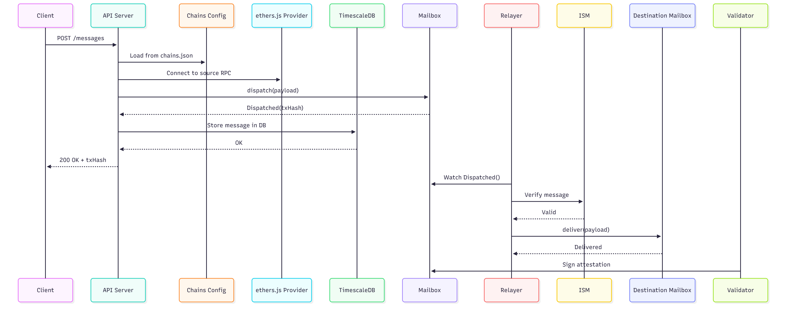

# Cross-Chain Messaging with Hyperlane

This project implements a simple cross-chain messaging API using Hyperlane. It allows clients to send messages between EVM-compatible blockchains via HTTP. Messages are dispatched from a source chain and received on a destination chain using Hyperlane’s generalized messaging protocol.

## How It Works

When a client submits a message, the API identifies the source and destination chains using a predefined config file. The API simulates a message dispatch through the Hyperlane Mailbox contract on the source chain using ethers.js and logs the event.

The Hyperlane Relayer listens for dispatched messages and verifies them using an Interchain Security Module (ISM). Once verified, the message is delivered to the destination chain’s Mailbox contract. Optionally, a Validator service signs attestations depending on the ISM configuration.

Messages are stored in a TimescaleDB instance for auditability and querying.

## Why Hyperlane?

Hyperlane provides modular interchain messaging with pluggable security. For this use case, it enables passing messages across chains without deploying custom bridging logic. Its ISM abstraction allows flexible trust models (e.g., validators, optimistic verification), making it ideal for both development and production-grade deployments.

This setup focuses on EVM ↔ EVM communication, but is designed to be extensible to non-EVM chains like Solana in future phases.

## Infrastructure

The project uses a Dockerized environment to emulate multi-chain interactions locally:

- `timescaledb`: Stores all sent messages with metadata (source, destination, payload, txHash, timestamp).
- `crosschain-api`: Express backend that exposes endpoints for sending and querying messages.
- `anvil-*`: Local chain simulators (Polygon, Arbitrum, Optimism, Sepolia) using Anvil, each with a different chain ID and RPC port.
- `hyperlane/relayer` and `hyperlane/validator`: Optional containers to simulate the relaying and security infrastructure.

Each service is defined in `infra/docker-compose.yml`, allowing everything to be run locally with one command.

## System Design

A visual overview of the architecture is provided in  .

## API

The API exposes endpoints for sending messages, retrieving chains, and querying message history. See `endpoints.rest` for usage examples.

## Future Workkk 

- Add user authentication and message signing (EIP-4361).
- Add frontend client in react (hmm)
- Expand support to non-EVM chains like Solana.
- Integrate on-chain message decryption and user-specific inboxes.
- Support delivery callbacks and confirmation receipts.
