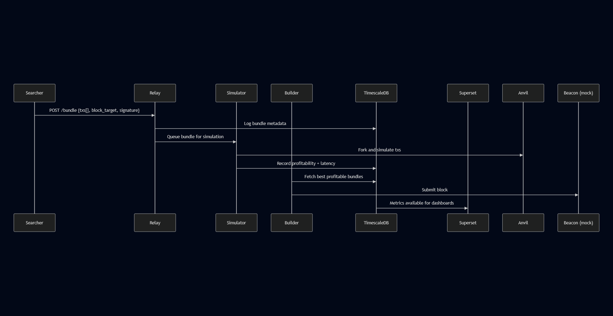

# MEV Relay – Full Protocol Implementation in Go

## Overview

This project implements a minimal Flashbots-style relay system built entirely in Go.
It coordinates bundle submission, simulation, profitability ranking, and block building, with metrics stored in TimescaleDB and visualized via Superset.

## Architecture

### Core Services

- **Relay:** Accepts MEV bundles from searchers over HTTP (JSON-RPC style).
- **Simulator:** Forks and simulates bundles using a local Geth-compatible node (Anvil by default).
- **Builder:** Selects the most profitable bundles, constructs blocks, and publishes inclusion data.
- **TimescaleDB:** Stores bundle metadata, simulation results, and builder metrics.
- **Superset:** Visualizes bundle latency and profitability metrics.
- **Geth (Anvil):** Provides a local EVM environment for simulation and testing.

## Sequence Summary

1. A searcher submits a bundle via `POST /relay/v1/bundle` containing `txs[]`, `block_target`, and `signature`.
2. The relay queues the bundle and forwards it to the simulator over gRPC.
3. The simulator forks the Geth/Anvil node, runs the transactions, and measures simulated profitability and latency.
4. The relay logs bundle metadata and simulation results into TimescaleDB.
5. The builder fetches the best profitable bundles, ranks them, and simulates inclusion latency.
6. The builder submits finalized blocks (mocked) to the beacon endpoint and stores build outcomes in TimescaleDB.
7. Superset reads from TimescaleDB and exposes dashboards showing propagation latency and MEV profitability.

## Infrastructure

- All components are containerized and orchestrated using **Docker Compose**.
- Each Go service builds via its own Dockerfile.
- The **TimescaleDB** container auto-runs schema migrations from `scripts/migrate.sql`.
- **Superset** runs its setup script automatically and connects to the shared network.
- A local **Geth-compatible chain (Anvil)** provides the EVM environment.

## Running the Stack

1. **Build and start all services:**

   ```bash
   docker-compose up --build
   ```
2. **Access the components:**

   * Relay API: [http://localhost:8080/relay/v1/bundle](http://localhost:8080/relay/v1/bundle)
   * Superset Dashboard: [http://localhost:8088](http://localhost:8088)
   * TimescaleDB: `localhost:5432` 
   * Geth/Anvil RPC: [http://localhost:8545](http://localhost:8545)

## Testing

An example test file (`endpoints.rest`) provides ready-to-use sample requests for bundle submission and health checks.

## Diagram

See  in the project root for the full end-to-end architecture visualization.
