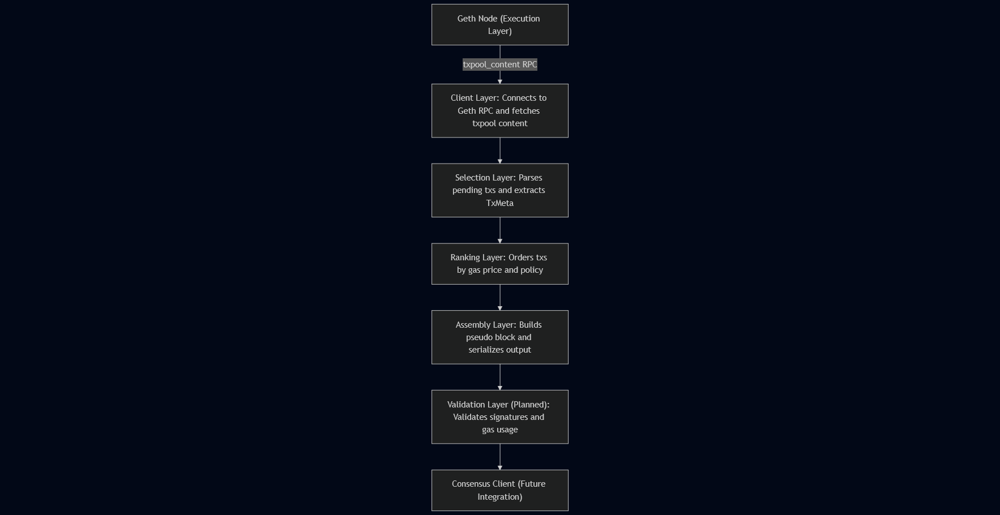
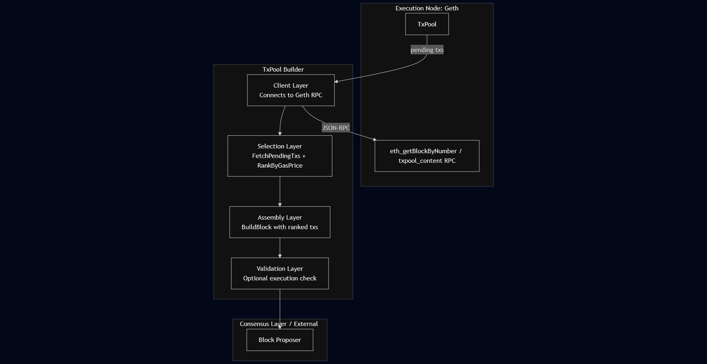
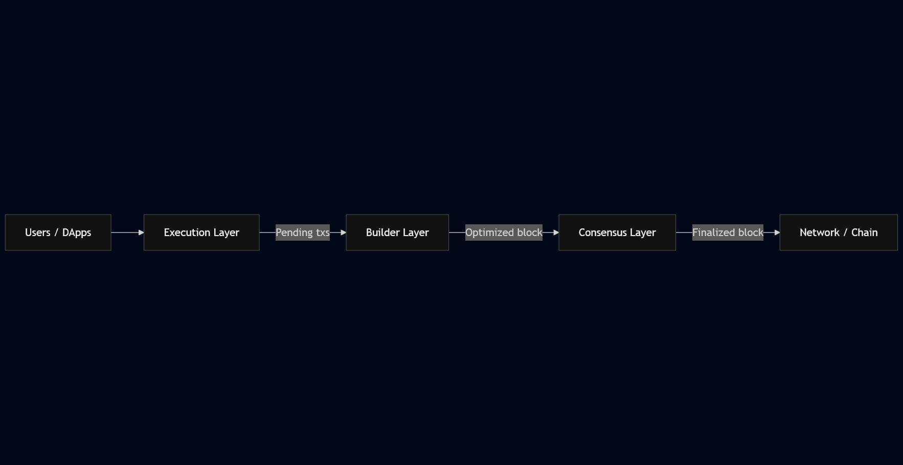

# TxPool Builder

## Description
A Go-based transaction selection and ordering engine.
Connects to a local Geth node, fetches pending transactions from the txpool,
ranks them by gas price, and assembles block candidates.

## Design


This project is a component of the transaction lifecycle





## Deployment:
1. Navigate to infra directory
```bash
   cd infra
```
2. Build and start containers
```bash   
   docker compose up --build
```
3. Containers:
   - geth: local devnet node with HTTP and txpool APIs
   - builder: connects to geth via GETH_RPC_URL

4. When running successfully, builder logs show:
   "connected to Geth node"
   "pseudo_block.json generated successfully"

5. Stop services
```bash   
   docker compose down
```
