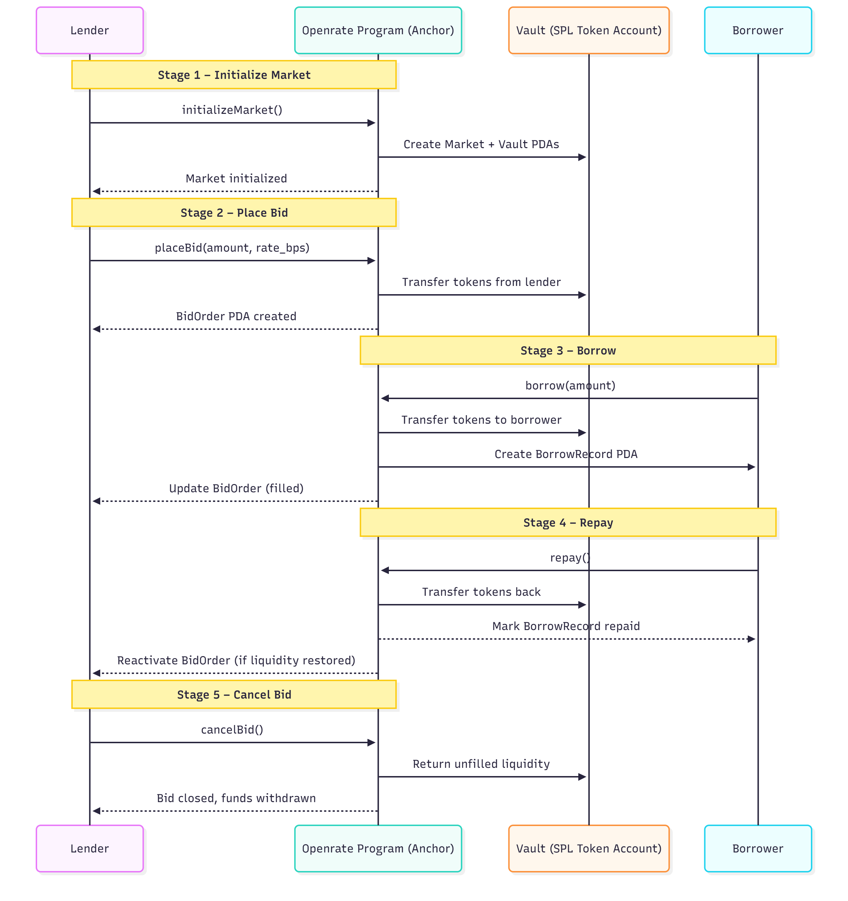

# Openrate: On-Chain Lending Auctions on Solana

Openrate is a decentralized lending protocol built on Solana using Anchor.  
Instead of relying on fixed-rate formulas, Openrate discovers real yield through on-chain lending auctions — lenders post bids with desired interest rates, and borrowers borrow from the most competitive offers.


## Features

- Dynamic yield discovery via bid-based auctions  
- Fully decentralized using PDAs and SPL Token vaults  
- Complete lender and borrower lifecycle: place bids, borrow, repay, cancel  
- Efficient matching: lowest-yield bids fill first  
- Modular and audit-ready Anchor codebase  


## Architecture

**Anchor Program:** `programs/openrate/src`  
- `state/` — defines on-chain accounts (Market, Vault, BidOrder, BorrowRecord)  
- `instructions/` — implements core program logic  
  - `initialize_market.rs`  
  - `place_bid.rs`  
  - `borrow.rs`  
  - `repay.rs`  
  - `cancel_bid.rs`  
- `errors.rs` / `utils.rs` — shared validation and PDA helpers  

**Client Tests:** 
`tests/openrate.ts`  
- initialises the market on anchor's local validator 

`tests/marketinteractions.ts`  
- Runs the full protocol lifecycle on anchor's local validator 


## Transaction Lifecycle

e2e tx lifecycle




## Local Setup

```bash
# 1. Install dependencies
yarn install


# 2. Important step tp reset ledger
rm -rf .anchor/test-ledger

# 3. Build the Anchor program
anchor build

# 4. Run tests (end-to-end lifecycle)
anchor test

# 5. Optional - local deploy
anchor deploy
```


## Program Flow

1. **initialize_market** – creates Market and Vault PDAs  
2. **place_bid** – lender deposits funds and defines rate  
3. **borrow** – borrower takes funds from available bids  
4. **repay** – borrower returns funds to vault  
5. **cancel_bid** – lender withdraws unfilled liquidity  


## Design Goals
- Model real-world bond and lending auctions on-chain  
- Provide a composable foundation for advanced yield markets  
- Test out anchor's ability to handle dynamic interactions over native implementation

## Future Extensions
- Continuous or epoch-based auctions  - still researching scalability
- Interest accrual feature
- Cross-market liquidity routing  - multithreading?
